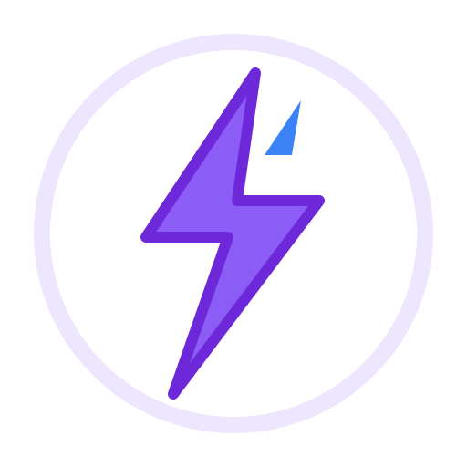

# ⚡ Chronos Hub — Personal Activity & Life Management Suite (PWA)



> **Chronos Hub** adalah aplikasi web **Progressive Web App (PWA)** modern, responsif, dan kaya fitur yang dirancang untuk mengelola kegiatan harian, agenda kalender ala Google Calendar, manajemen tugas dengan Papan Kanban & Matriks Eisenhower, serta pengumuman penting yang tersinkronisasi otomatis ke cloud.

---

## ✨ Fitur-Fitur Utama

### 📅 1. Kalender Interaktif & Pengulangan Murni (Google Calendar Style)
- **Recurrence Engine**: Pengulangan agenda otomatis (*Harian, Setiap Hari Kerja, Mingguan, Bulanan, dan Tahunan*) tanpa duplikasi fisik data.
- **Tampilan Bersambung (Connected Multi-Day Banners)**: Agenda multi-hari tersambung secara otomatis melintasi kotak kalender.
- **Mode Tampilan Kalender**: Dukungan mode **Bulan (Month View)**, **Minggu (Week View)**, dan **Hari (Day View)**.
- **Opsi Sepanjang Hari (All Day Event)** & Pemilih Waktu 24 Jam.

### 📋 2. Manajemen Tugas & Matriks Prioritas (Eisenhower Matrix)
- **Papan Kanban**: Kolom status *To Do*, *In Progress*, dan *Done*.
- **Matriks Eisenhower**: Pengelompokan 4 kuadran prioritas (*Urgent & Penting*, *Penting Tapi Tidak Urgent*, *Urgent Tapi Tidak Penting*, *Tidak Urgent & Tidak Penting*).
- **Sub-task / Checklist**: Progres bar checklist interaktif pada setiap tugas.
- **Efek Selebrasi Confetti**: Animasi kembang api *confetti* saat menyelesaikan tugas.

### 📢 3. Spanduk Pengumuman & Alert Kegiatan
- Spanduk pengumuman atas untuk agenda-agenda kritis terdekat.
- Opsi otomatis publikasi agenda kalender ke Spanduk Pengumuman.
- Penanda pengumuman belum dibaca (*Unread Badge*) yang otomatis hilang saat dibaca.

### 🔒 4. Keamanan App Lock PIN & Fitur Privasi
- Pola penguncian Layar PIN (*Passcode Lock Screen*).
- **Auto-Lock**: Aplikasi otomatis mengunci sendiri saat beralih tab browser atau layar HP mati.

### 🔥 5. Firebase Cloud & Multi-User Auth Isolation
- **Firebase Authentication**: Login Email/Password dan Google OAuth.
- **Isolasi Data**: Setiap pengguna memiliki data dashboard privat yang terpisah di Firebase Realtime Database (`user_dashboards/{uid}`).
- **Koneksi Otomatis Zero-Setup**: Langsung terhubung secara otomatis di perangkat mana pun tanpa perlu input API Key.

### 🎨 6. 15 Tema Warna Preset & Custom HEX Picker
- 15 Pilihan tema warna (*Royal Blue, Emerald, Sunset Orange, Cyberpunk Purple, Emerald Dark, Mocha Gold, dll.*).
- **Custom HEX Color Picker**: Masukkan kode HEX (`#hexCode`) untuk kustomisasi warna aksen dinamis secara real-time.

### 📲 7. Progressive Web App (PWA) Ready
- Service Worker (`sw.js`) untuk dukungan offline.
- Tombol **📱 Install App** 1-Klik di navigasi atas untuk memasukkan aplikasi ke layar utama HP (Android / iOS) atau Laptop.

### 🔔 8. Web Notification API & Alert Ringtone Synthesizer
- Notifikasi pengingat otomatis browser (H-7, H-5, H-3, H-1, dan Hari H).
- **5 Opsi Nada Dering Synthesizer**: *Standard Bell, Digital Chime, Gentle Harp, Loud Alarm, Radar Pulse*.

---

## 🛠️ Teknologi yang Digunakan

- **Core Framework**: React 19 + Vite 8
- **Styling**: Vanilla CSS3 + Glassmorphism Architecture & Modern Dark Mode
- **Iconography**: Lucide React Vector SVG Icons
- **Backend & Auth**: Firebase 12 (Realtime Database & Authentication)
- **Effects**: Canvas Confetti
- **Deployment Target**: Cloudflare Pages / Static Hosting

---

## 🚀 Cara Menjalankan Project (Local Development)

### 1. Prasyarat
Pastikan Anda sudah menginstall [Node.js](https://nodejs.org/) (versi 18+ direkomendasikan) pada komputer Anda.

### 2. Clone Repository
```bash
git clone https://github.com/USERNAME_ANDA/chronos-hub.git
cd chronos-hub
```

### 3. Install Dependensi
```bash
npm install
```

### 4. Jalankan Server Lokal
```bash
npm run dev
```
Buka browser dan akses `http://localhost:5173/` atau `http://IP_LOKAL:5173/` melalui HP Anda.

---

## 📦 Build & Deployment

### Build untuk Produksi
```bash
npm run build
```
File siap sebar akan tercipta di folder `dist/`.

### Publish ke Cloudflare Pages (Single Command)
```bash
npm run deploy
```

---

## 📄 Struktur Folder Project

```text
chronos-hub/
├── public/
│   ├── favicon.svg          # Logo Utama Aplikasi
│   ├── icon.png             # Ikon PWA 512x512
│   ├── manifest.json        # PWA Web App Manifest
│   ├── sw.js                # Service Worker PWA Offline
│   └── _redirects           # Cloudflare Pages SPA Router
├── src/
│   ├── components/          # Komponen UI (Navbar, Calendar, TaskManager, Modal, dll)
│   ├── data/                # Initial Data & Categories
│   ├── services/            # Firebase Realtime DB & Auth Service
│   ├── utils/               # Recurrence Engine, Date Utils, Theme & Security Engine
│   ├── App.jsx              # Komponen Utama Application Router
│   ├── index.css            # Design System Tokens & Glassmorphism Styles
│   └── main.jsx             # Entry Point React App
├── package.json
└── README.md
```

---

## 👨‍💻 Penulis & Lisensi

Dibuat dengan ❤️ oleh **Husein Rosid**  
Lisensi: **MIT License** — Bebas digunakan dan dikembangkan secara pribadi maupun terbuka.
